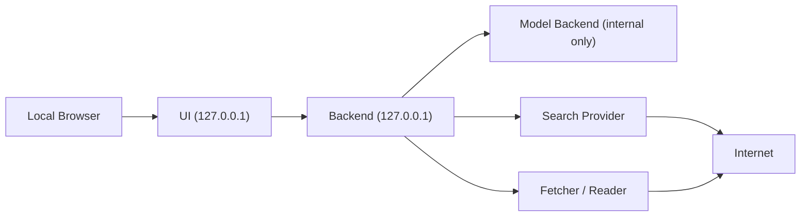

# Architecture

## Overview

AnonExplo uses a local-first, privacy-first service layout:

- `ui`
  - local browser interface for prompts, provider status, and grounding inspection
- `backend`
  - orchestrator that owns provider routing and exposes a stable local API
- `model-backend`
  - isolated local inference runtime
- `search-provider`
  - anonymized search service, default example SearXNG
- `fetcher`
  - page fetch and read pipeline that turns URLs into readable text

## Service Boundaries

The UI must only talk to the backend. The backend may talk to the model backend, search provider, and fetcher. The model backend should never need direct internet access.

## Network Topology

## Docker Networks

- `core_internal`
  - internal bridge network for UI, backend, fetcher, and search-provider coordination
- `model_internal`
  - internal bridge network reserved for backend to model-runtime traffic
- `egress`
  - bridge network only for services that must reach the public internet

### Default network membership

- UI:
  - `core_internal`
- backend:
  - `core_internal`
  - `model_internal`
- fetcher:
  - `core_internal`
  - `egress`
- search-provider:
  - `core_internal`
  - `egress`
- model-backend:
  - `model_internal`

## Provider Abstraction Strategy

The backend uses environment-driven provider selection:

- model:
  - `MODEL_PROVIDER`
  - `MODEL_BASE_URL`
  - `MODEL_NAME`
- search:
  - `SEARCH_PROVIDER`
  - `SEARCH_BASE_URL`
- fetch:
  - `FETCH_BASE_URL`

The current code includes:

- an OpenAI-compatible model adapter
- a SearXNG search adapter
- a fetcher client that calls the internal fetch service
- a grounded-answer path that composes bounded source context before calling the model

This keeps future runtime changes small. A new model runtime should usually mean a new adapter or a new base URL, not a full backend rewrite.

## Data Flow

### Plain prompt flow

1. UI sends a prompt to the backend.
2. Backend forwards the request to the configured model adapter.
3. Backend returns the model response to the UI.

### Grounded search flow

1. UI submits a grounding query to the backend.
2. Backend calls the configured search provider.
3. Backend selects result URLs to fetch.
4. Backend calls the fetcher service for readable page text.
5. Backend deduplicates sources, applies bounded context limits, and packages structured source metadata plus fetch errors.
6. Backend can return the grounding bundle directly or use it to call the configured model adapter for a grounded answer.
7. UI shows the grounded answer, the selected sources, and any per-source fetch failures.

## Why The Fetcher Is Separate

Search snippets alone are not enough. The fetcher exists so the system can retrieve, parse, and normalize article text without giving the model backend internet access.

## First Runtime Profile

The first concrete local runtime profile is `llama.cpp` in CUDA server mode, exposed as an OpenAI-compatible endpoint. See `docs/LLAMA_CPP_RUNTIME_PROFILE.md` for the pinned image, default settings, and provisioning flow.
