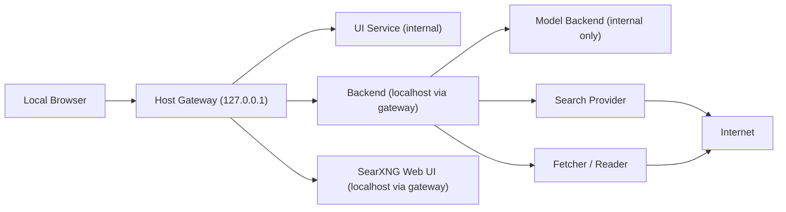

# Architecture

## Overview

AnonExplo uses a local-first, privacy-first service layout:

- `host-gateway`
  - localhost-only reverse proxy that exposes the UI, backend, and optional standalone SearXNG UI to the host without putting those app services directly on a non-internal Docker network
- `ui`
  - local browser interface for prompts, browser-local direct chat history, modal settings, provider status, grounding inspection, and separate direct/grounded/fetch workspaces
- `backend`
  - orchestrator that owns provider routing and exposes a stable local API
- `model-backend`
  - isolated local inference runtime
- `search-provider`
  - anonymized search service, default example SearXNG
- `fetcher`
  - page fetch and read pipeline that turns URLs into readable text

## Service Boundaries

The UI must only talk to the backend. The backend may talk to the model backend, search provider, and fetcher. The model backend should never need direct internet access.

## Network Topology

## Docker Networks

- `core_internal`
  - internal bridge network for host-gateway, UI, backend, fetcher, and search-provider coordination
- `host_access`
  - non-internal bridge used only by the localhost reverse proxy so Docker Desktop can publish `127.0.0.1` ports reliably on the host
- `model_internal`
  - internal bridge network reserved for backend to model-runtime traffic
- `egress`
  - bridge network only for services that must reach the public internet

### Default network membership

- host-gateway:
  - `host_access`
  - `core_internal`
- UI:
  - `core_internal`
- backend:
  - `core_internal`
  - `model_internal`
- fetcher:
  - `core_internal`
  - `egress`
- search-provider:
  - `core_internal`
  - `egress`
- model-backend:
  - `model_internal`

## Provider Abstraction Strategy

The backend uses environment-driven provider selection:

- model:
  - `MODEL_PROVIDER`
  - `MODEL_BASE_URL`
  - `MODEL_NAME`
- search:
  - `SEARCH_PROVIDER`
  - `SEARCH_BASE_URL`
  - `SEARCH_CATEGORIES`
  - `SEARCH_LANGUAGE`
  - `SEARCH_TIME_RANGE`
  - `SEARCH_ENGINES`
- fetch:
  - `FETCH_BASE_URL`

The current code includes:

- a localhost-only reverse proxy in front of the UI, backend, and optional standalone SearXNG host ports
- an OpenAI-compatible model adapter
- a native Ollama model adapter
- a SearXNG search adapter
- a YaCy search adapter
- a fetcher client that calls the internal fetch service
- a grounded-answer path that composes bounded source context before calling the model
- a runtime-readiness probe that distinguishes configuration from live model availability
- structured fetcher error propagation so the backend and UI can distinguish blocked, rate-limited, thin-content, and generic fetch failures

This keeps future runtime changes small. A new model runtime should usually mean a new adapter or a new base URL, not a full backend rewrite.
The backend also no longer hard-depends on a Compose service literally named `search-provider`, so `SEARCH_BASE_URL` can point at any reachable internal or local search service that matches one of the supported adapters.
The host-facing `127.0.0.1` ports now come from the dedicated `host-gateway` service rather than from direct publishing on internal-only app containers, because Docker Desktop did not reliably expose those ports when the services were attached only to `internal: true` networks. That same gateway also provides an optional browser path to the bundled SearXNG service, so standalone search and LLM-grounded search can coexist without changing the internal network shape.
The validation path now treats that network and exposure model as enforceable policy: only the gateway may publish host ports, third-party runtime images stay digest-pinned by default, and the expected service-to-network memberships are checked before a branch is declared ready. The backend route on the localhost gateway also now allows longer-lived grounded requests so search-plus-fetch-plus-model calls do not get cut off at the proxy first.

## Data Flow

### Plain prompt flow

1. UI sends a prompt to the backend.
2. UI may include direct-chat-specific saved instructions from the browser-local settings modal.
3. UI may include a request-level model selection sourced from the runtime-advertised model list.
4. Backend validates that selection against the runtime when possible and forwards the request to the model adapter.
5. Backend returns the model response plus selection metadata to the UI.
6. The browser may present that exchange inside a local conversation-style shell and persist direct-chat history locally in browser storage.
7. Direct Chat intentionally does not call the search provider or fetcher.

### Grounded search flow

1. UI submits a grounding query to the backend.
2. UI may include grounded-answer-specific saved instructions plus default search and fetch limits from the browser-local settings modal.
3. Backend calls the configured search provider with env-driven search tuning such as categories, language, and optional time-range or engine filters.
4. Backend deduplicates results, ranks unique candidates by query relevance while preserving domain diversity, and selects an initial fetch batch.
5. Backend calls the fetcher service for readable page text, classifies thin or blocked fetch outcomes explicitly, and keeps trying later-ranked sources when earlier fetches fail.
6. Backend packages bounded fetched source text when available, or bounded search-result snippets when fetches fail but search material still exists.
7. Backend marks the grounding bundle with an explicit `context_mode` so the UI and future services can distinguish fetched article text from snippet fallback.
8. Backend can return the grounding bundle directly or use it to call the selected model through the configured model adapter for a grounded answer.
9. UI shows the grounded answer, the selected model, the selected or attempted sources, the current grounding mode, and any per-source fetch failures.
10. Grounded-answer transcripts and source bundles remain transient in the current tab rather than persistent browser storage.

## Why The Fetcher Is Separate

Search snippets alone are not enough. The fetcher exists so the system can retrieve, parse, and normalize article text without giving the model backend internet access.
The current fetcher pass also classifies thin extractions so the backend can reject paywall-shell or otherwise low-value pages instead of pretending they are usable grounding context. It still uses direct HTML fetches only; no third-party reader proxy or Wikipedia-specific bypass is bundled at this stage.

## First Runtime Profile

The first concrete local runtime profile is `llama.cpp` in CUDA server mode, exposed as an OpenAI-compatible endpoint. The Compose profile now sets an explicit alias for the configured model name so the runtime, backend, and UI share the same stable identifier. See `docs/LLAMA_CPP_RUNTIME_PROFILE.md` for the pinned image, the default GGUF source and checksum, and the provisioning and validation flow.
